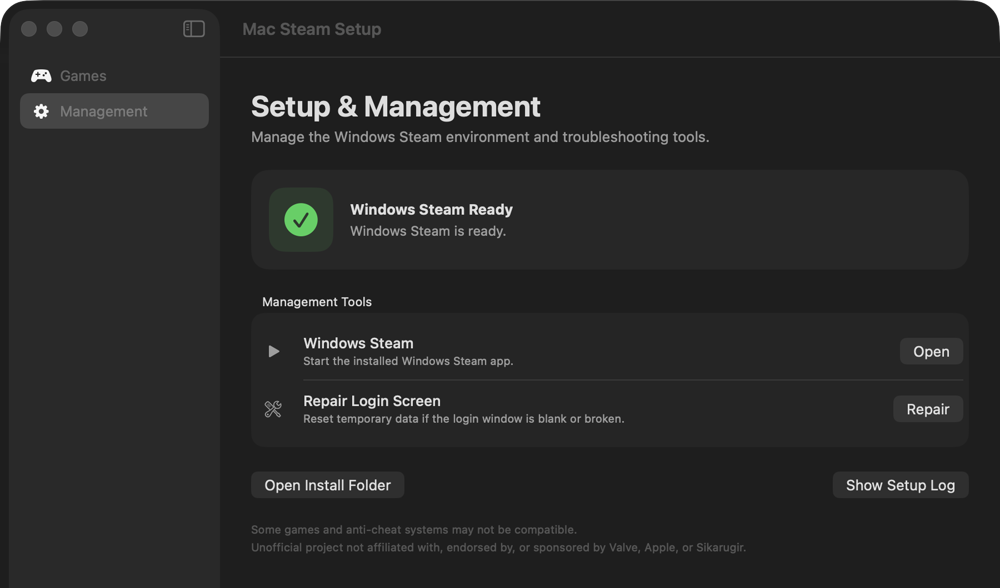

# Mac Steam Setup: Apple Silicon Mac에서 Windows Steam 게임 실행하기

**한국어** | [English](README.md)

<p align="center">
  
</p>

**Apple Silicon Mac에서 Windows Steam을 설치하고 호환되는 Windows 전용 Steam 게임을 실행하도록 돕는 무료 오픈소스 macOS 앱입니다.** Windows 가상 머신이나 CrossOver 구독 없이 Sikarugir/Wine과 D3DMetal 설정을 자동화합니다.

[DMG 베타 다운로드](https://github.com/heung115/mac-steam-setup/releases/download/v0.13-beta.1/Mac-Steam-Setup-v0.13-beta.1.dmg) · [의견 나누기](https://github.com/heung115/mac-steam-setup/discussions) · [버그·게임 호환성 제보](https://github.com/heung115/mac-steam-setup/issues/new/choose)

[](https://github.com/heung115/mac-steam-setup/actions/workflows/ci.yml)   [](LICENSE)

<p align="center">
  
  <br>
  <sub>현재 베타의 영문 설치 및 관리 화면입니다.</sub>
</p>

## 빠른 시작

1. [Mac Steam Setup v0.13-beta.1 DMG](https://github.com/heung115/mac-steam-setup/releases/download/v0.13-beta.1/Mac-Steam-Setup-v0.13-beta.1.dmg)를 받습니다. 다른 버전과 대체 ZIP은 [GitHub Releases](https://github.com/heung115/mac-steam-setup/releases)에서 확인할 수 있습니다.
2. DMG를 열고 `Mac Steam Setup.app`을 함께 보이는 `Applications` 폴더로 드래그합니다.
3. `Mac Steam Setup.app`을 한 번 실행해 봅니다.
4. macOS가 차단하면 `시스템 설정 → 개인정보 보호 및 보안 → 그래도 열기`를 선택합니다. 한 번만 승인하면 됩니다.
5. 앱을 열고 `Windows Steam 준비하기`를 선택한 뒤 Steam 설치창에서 기본 경로로 설치를 마칩니다.

현재 베타는 임시 서명을 사용하며 Apple 공증을 받지 않았습니다. 반드시 이 저장소에서 내려받으세요. 각 릴리스에는 다운로드 파일을 검증할 수 있는 `.sha256` 파일이 함께 제공됩니다.

## 요구 사항과 제한 사항

- macOS 14 이상을 실행하는 Apple Silicon Mac이 필요하며 Intel Mac은 지원하지 않음
- Wine 래퍼, Steam, 설치할 게임을 위한 충분한 저장 공간 필요
- 사용자의 Steam 계정과 직접 소유한 게임 필요
- 게임마다 호환성이 다르며 안티치트나 추가 런처 때문에 실행되지 않을 수 있음
- Windows나 가상 머신이 아니라 Wine 호환성 래퍼를 사용하는 방식
- 바로가기로 게임을 직접 열 수 있지만 Steam DRM 게임은 Windows Steam이 백그라운드에서 실행되어야 함

## 주요 기능

- 단계별 설치 진행률과 다운로드 용량 표시
- macOS 언어에 따라 한국어와 영어 자동 전환
- 중복 설치와 중복 실행 요청 차단
- 공식 Sikarugir 엔진, Wine 래퍼, D3DMetal, Steam 경로 설정
- 설치 후 남는 프로세스 정리와 백그라운드 Sikarugir Dock 아이콘 숨김
- 필요할 때 Steam 로그인 웹 캐시 복구
- Windows Steam과 실행 중인 Windows 게임 완전 종료
- 설치된 Steam manifest를 읽어 가벼운 Mac 게임 바로가기 생성
- 기존 macOS Steam과 Porting Kit 설치는 변경하지 않음

## 동작 방식

릴리스에는 작은 Mac Steam Setup 앱만 들어갑니다. 설치를 시작하면 고정된 Sikarugir 엔진·래퍼 릴리스와 Valve의 Steam 설치 파일을 공식 배포 주소에서 내려받습니다. Windows, Steam, Wine, D3DMetal, Sikarugir 압축 파일 또는 게임을 앱에 포함하지 않습니다.

Windows Steam에서 게임을 설치한 뒤, 해당 Steam App ID를 래퍼에서 실행하는 작은 Mac 앱을 만들 수 있습니다. 바로가기는 게임이나 Wine 환경을 복제하지 않습니다.

일부 네트워크에서는 Steam의 초기 연결 검사에 약 1분이 걸릴 수 있습니다. 정상 실행에서도 IPv6 `TIMEOUT`이 기록될 수 있으므로 [Windows Steam 시작 지연 조사 기록](docs/diagnostics/steam-startup-network-delay.md)을 참고하세요. Wine 초기 updater가 한국어 글꼴을 제대로 표시하지 못해 Steam은 영어 기본값으로 준비되며, 이후 Steam 설정에서 언어를 변경할 수 있습니다.

## 빌드와 검증

소스에서 앱을 빌드합니다.

```sh
./build.command
```

테스트를 실행합니다.

```sh
bash Tests/run.sh
```

테스트는 설치 상태 판정, 단조 증가 진행률, Steam 설치 완료 결정, 래퍼 설정, 중복 실행 식별, 캐시 복구, 완전 종료, manifest 파싱과 바로가기 생성·서명을 검사합니다.

macOS 26.6.2, M4 Pro, Steam 빌드 `1785799196`에서 다음 항목을 확인했습니다.

- Steam 설치 및 최신 클라이언트 업데이트
- 로그인 창 렌더링과 `steamwebhelper` 5분 이상 유지
- 로그인 캐시 초기화 후 재실행
- 중복 실행 요청 차단
- Sikarugir 실행기 Dock 아이콘 숨김
- Windows Steam 전체 프로세스 종료 후 재실행

위 검증은 설치 흐름에 관한 것이며 모든 게임의 호환성을 의미하지 않습니다.

## 의견과 게임 호환성 제보

- 사용 후기, 질문, 아이디어: [GitHub Discussions](https://github.com/heung115/mac-steam-setup/discussions)
- 설치·실행 오류: [버그 신고 양식](https://github.com/heung115/mac-steam-setup/issues/new?template=bug-report.yml)
- 실행해 본 Windows 게임: [게임 호환성 제보 양식](https://github.com/heung115/mac-steam-setup/issues/new?template=game-compatibility.yml)

잘 실행된 게임도 알려주세요. 로그나 화면을 첨부하기 전에 계정 이름, 이메일 주소, 로컬 파일 경로 등 개인정보를 제거해 주세요.

## 프로젝트 상태, 배포와 라이선스

Mac Steam Setup은 비상업적 오픈소스 프로토타입입니다. Valve Corporation, Apple Inc. 또는 Sikarugir 프로젝트와 제휴하거나 이들로부터 승인·후원받지 않은 독립적인 비공식 커뮤니티 프로젝트입니다. Steam 및 Steam 로고는 Valve Corporation의 상표 또는 등록상표이며, 이 프로젝트는 Steam 로고나 Valve의 공식 디자인 자산을 사용하지 않습니다.

CI 릴리스에는 Mac Steam Setup만 포함할 수 있습니다. 완성된 `Steam.app`, Steam 클라이언트, 게임, Wine, D3DMetal 또는 Sikarugir 엔진·템플릿 압축 파일을 포함하면 안 됩니다. Gatekeeper 경고 없는 공개 다운로드에는 Developer ID 서명과 Apple 공증이 필요하며, 서명 자격 증명은 CI 암호화 비밀값으로만 관리해야 합니다.

이 저장소의 자체 코드는 [MIT License](LICENSE)로 배포됩니다. 이 라이선스는 제3자 구성요소에 대한 권리를 부여하지 않습니다. 자세한 내용은 [THIRD_PARTY_NOTICES.md](THIRD_PARTY_NOTICES.md)를 확인하세요.
