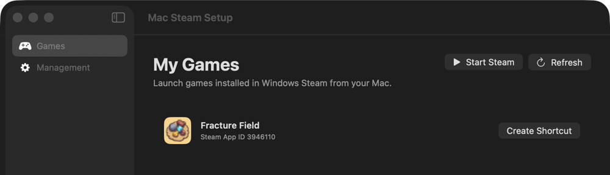

# Mac Steam Setup: Run Windows Steam Games on Apple Silicon Mac

**English** | [한국어](README.ko.md)

<p align="center">
  
</p>

**A free, open-source macOS app that helps Apple Silicon Mac users install Windows Steam and launch compatible Windows-only Steam games.** It automates the Sikarugir/Wine and D3DMetal setup without requiring a Windows virtual machine or a CrossOver subscription.

[Download DMG beta](https://github.com/heung115/mac-steam-setup/releases/download/v0.13-beta.1/Mac-Steam-Setup-v0.13-beta.1.dmg) · [Share feedback](https://github.com/heung115/mac-steam-setup/discussions) · [Report a bug or game](https://github.com/heung115/mac-steam-setup/issues/new/choose)

[](https://github.com/heung115/mac-steam-setup/actions/workflows/ci.yml)   [](LICENSE)

<p align="center">
  
  <br>
  <sub>Current beta game-shortcuts screen in English. The listed game is an installed-library example, not a compatibility guarantee.</sub>
</p>

## Quick start

1. Download the [Mac Steam Setup v0.13-beta.1 DMG](https://github.com/heung115/mac-steam-setup/releases/download/v0.13-beta.1/Mac-Steam-Setup-v0.13-beta.1.dmg). Other versions and the fallback ZIP are available on [GitHub Releases](https://github.com/heung115/mac-steam-setup/releases).
2. Open the DMG and drag `Mac Steam Setup.app` onto the `Applications` folder shown beside it.
3. Try to open `Mac Steam Setup.app` once.
4. If macOS blocks it, go to **System Settings → Privacy & Security → Open Anyway**. This approval is only required once.
5. Open the app, choose **Prepare Windows Steam**, and complete the Steam installer using its default path.

The current beta uses an ad-hoc signature and is not notarized by Apple. Download it only from this repository. A `.sha256` file is included with each release so you can verify the download.

## Requirements and limitations

- Apple Silicon Mac running macOS 14 or later; Intel Macs are not supported
- Enough free storage for the Wine wrapper, Steam, and each installed game
- A Steam account and games owned by the user
- Game compatibility varies; anti-cheat systems and additional launchers may prevent some games from running
- This is a Wine compatibility wrapper, not Windows or a virtual machine
- Generated shortcuts can open games directly, but Steam DRM games still require Windows Steam in the background

## What it does

- Shows step-by-step setup progress and downloaded size
- Follows the macOS language automatically in English and Korean
- Prevents duplicate installation and launch requests
- Configures the official Sikarugir engine, Wine wrapper, D3DMetal, and Steam path
- Cleans up setup processes and hides the background Sikarugir Dock icon
- Repairs the Steam login web cache when needed
- Completely stops Windows Steam and running Windows games
- Reads installed Steam manifests and creates lightweight macOS game shortcuts
- Leaves existing macOS Steam and Porting Kit installations unchanged

## How it works

Releases contain only the small Mac Steam Setup app. The app downloads pinned Sikarugir engine and wrapper releases and Valve's Steam installer from their official distribution URLs when setup begins. It does not bundle Windows, Steam, Wine, D3DMetal, Sikarugir archives, or games.

After a game is installed through Windows Steam, Mac Steam Setup can generate a small macOS app that starts Steam in the wrapper and launches the corresponding Steam App ID. The shortcut does not copy the game or Wine environment.

Steam's initial network check may take about a minute on some connections. An IPv6 `TIMEOUT` can also appear during an otherwise normal launch; see the [Windows Steam startup network-delay notes](docs/diagnostics/steam-startup-network-delay.md). The initial Wine updater cannot render Korean fonts correctly, so Steam is prepared in English by default. You can change the language later in Steam settings.

## Build and verify

Build the app from source:

```sh
./build.command
```

Run the test suite:

```sh
bash Tests/run.sh
```

Tests cover installation-state detection, monotonically increasing progress, Steam installation completion, wrapper configuration, duplicate-process detection, cache repair, full shutdown, manifest parsing, and shortcut creation and signing.

The following checks were completed on macOS 26.6.2 with an M4 Pro and Steam build `1785799196`:

- Steam installation and update to the latest client
- Login-window rendering and `steamwebhelper` stability for more than five minutes
- Restart after clearing the login cache
- Duplicate launch-request prevention
- Hidden Sikarugir launcher Dock icon
- Restart after completely terminating all Windows Steam processes

These checks verify the setup workflow, not universal game compatibility.

## Feedback and game compatibility reports

- Experiences, questions, and ideas: [GitHub Discussions](https://github.com/heung115/mac-steam-setup/discussions)
- Installation or launch problems: [bug report form](https://github.com/heung115/mac-steam-setup/issues/new?template=bug-report.yml)
- A Windows game you tested: [game compatibility form](https://github.com/heung115/mac-steam-setup/issues/new?template=game-compatibility.yml)

Successful games are worth reporting too. Before attaching a log or screenshot, remove account names, email addresses, local file paths, and other personal information.

## Project status, distribution, and license

Mac Steam Setup is a non-commercial open-source prototype. This is an independent, unofficial community project and is not affiliated with, endorsed by, sponsored by, or approved by Valve Corporation, Apple Inc., or the Sikarugir project. Steam and the Steam logo are trademarks and/or registered trademarks of Valve Corporation. This project does not use the Steam logo or Valve's official design assets.

CI-built releases may contain only Mac Steam Setup. Do not include a completed `Steam.app`, the Steam client, games, Wine, D3DMetal, or Sikarugir engine and template archives. Public downloads without a Gatekeeper warning require Developer ID signing and Apple notarization; signing credentials must remain in encrypted CI secrets.

The original code in this repository is licensed under the [MIT License](LICENSE). That license does not grant rights to third-party components. See [THIRD_PARTY_NOTICES.md](THIRD_PARTY_NOTICES.md) for details.
